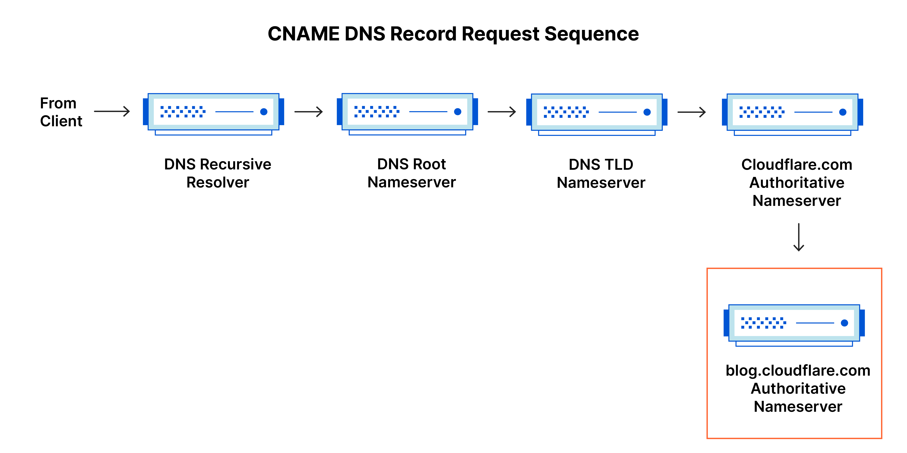

# TLD (Top-Level Domain)
Örneğin, github.com'daki .com kısmı bir TLD'dir. TLD'ler ikiye ayrılır

## gTLD (Generic Top Level Domain)
Belirli amaçlar için ayrılmış top level domainlere denir. Örneğin. .org -> organization, .com -> commercial

## ccTLD (Country Code Top Level Domain)

Ülke kodlarına göre .tr, .uk, .us şeklindedir.

# Second-Level Domain

Örneğin, github.com'daki github kısmıdır. 

# Subdomain

Belirli bir domainde farklı hizmetler çalıştırmak için "mail.google.com" gibi alt alanlar atanabilir. Aynı zamanda jupiter.mail.example.com şeklinde de birden fazla subdomain içerebilir.

# DNS Records

Bir çok çeşit DNS kaydı türü bulunmaktadır. Bunlardan en yaygın olanları şu şekildedir;

## A Record

Domain name'leri IPv4 adreslerine çözümlemeye yarayan IPv4 kayıtlarını tutar.

## AAAA Record

Domain name'leri IPv6 adreslerine çözümlemeye yarayan IPv6 kayıtlarını tutar.

## CNAME Record (Canonical Record)

Bir alan adını başka bir alan adına yönlendirmek için kullanılır. Yani aslında bir alan adının diğer bir alan adına takma ad (alias) olmasını sağlar. Örneğin, blog.example.com'dan -> example.com'a şeklinde bir CNAME kaydı oluşturulursa, blog.example.com'a yapılan istekler önce example.com'a yönlendirilecektir.

## MX Record (Mail Exchange Record)

Bir alan adına gelen maillerin hangi mail sunucusuna yönlendirileceğini belirleyen DNS kaydıdır.

## TXT Record (Text Record)

Kısaca söylemek gerekirse TXT Record'ları, DNS serverlerinde depolanan metin tabanlı dosyalardır. Bu text dosyaları bir çok farklı amaç için kullanılabilir ama en yaygın kullanım yerlerinden biri domain adresine mail göndermeye yetkili olan serverların listesini içerebilir. Ayrıca TXT Record'lar, 3. taraf hizmetlere kaydolmak için domain isminin mülkiyetini doğrulamak amacıyla da kullanılabilir.

# What happens when you make a DNS request?

Bir domain name'e istek atıldığında ilk önce bilgisayarınız kendi local cache'inden bu domaini içerip içermediğini kontrol eder. Eğer daha önceden bu domain ziyaret edilmişse yerel önbellekte depolanıyor olabilir. Eğer burada yoksa "Recursive DNS Server"inize bir istek atılır. Recursive DNS serverler ISP tarafından size atanmış olabileceği gibi kendiniz de ayrıca bir tanesine sahip olabilirsiniz. Bu server de aynı bilgisayar da olduğu gibi kendi local cache'inden domain name'lerini kontrol edecektir. Eğer bu bilgi yerel olarak daha önceden depolanmışsa, direk olarak bilgisayar bu yanıt gönderilir. Bu, Facebook, Youtube, Google gibi sık ziyaret edilen domainlerde mümkün olabilir. Fakat eğer depolanmamışsa, doğru cevabı bulmak için ilk olarak root DNS serverlarına başvurulması gerekir.

Root serverları internetin DNS backbone'ununu oluşturur yani bir nevi DNS'lerin belkemiğidir. Bu serverların yaptığı şey isteği, istekte bulunan domaine bağlı olarak ilgili TLD serverına yönlendirmektir. Örneğin www.tryhackme.com'a gidilmek istendiğinde root serverları bu isteği .com adresleriyle ilgilenen TLD servarlarına yönlendirecektir. TLD serverları DNS isteğine yanıt verecek uthoritative servarların nerede olduğunun kaydını tutar. Bu authoritative serverlara aynı zamanda DNS isteği atılan domainin "nameserver"ları da denir. Örneğin, tryhackme.com'ın nameserverları kip.ns.cloudflare.com ile uma.ns.cloudflare.com'dır. Bir domain name için genelde birden fazla nameserver bulunduğuna denk gelebilirsiniz. Bu birinin çökmesi durumunda diğerinin yedek görevi görmesine olanak tanır.

Authoritative serverlar ilgili domain name ile ilgili kayıtları tutan ve bu kayıtlarla ilgili yapılacak herhangi bir güncellemenin yer alacağı yerlerdir. Kaydın türüne bağlı olarak, DNS kaydı recursive DNS serverına geri gönderilir ve burada gelecekte aynı domain name'e yapılabilecek bir istek için kopyası alınarak önbellekte depolanır. Daha sonrasında ise tekrardan kaynak istemciye gönderilir. Tüm DNS Record'ları bir TTL'e (time to live) sahiptir. Bu süre içerisinde istek yapılırsa, bu istek recursive serverdan öteye gitmeden direk yanıtlanabilir. Eğer bu süre içerisinde bir istek yapılmazsa, kayıt önbellekten silinmiş olacağından süreç tekrardan yukarıda belirtildiği haliyle işler.

