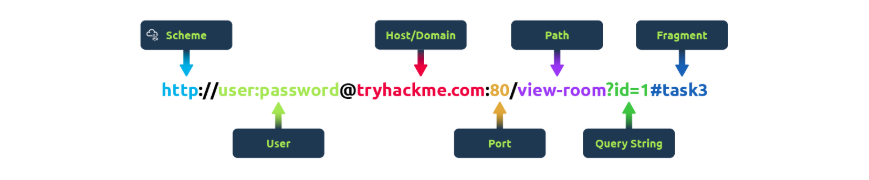
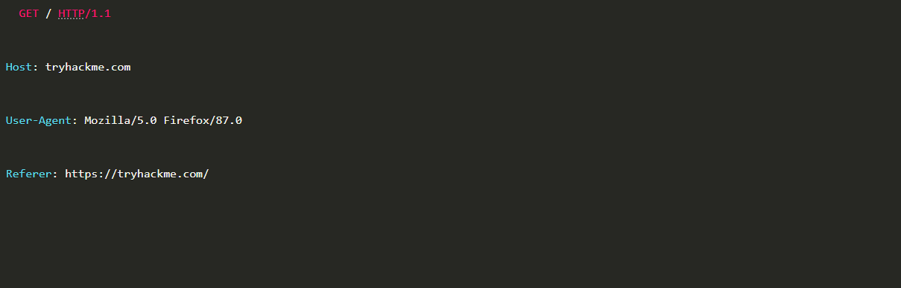
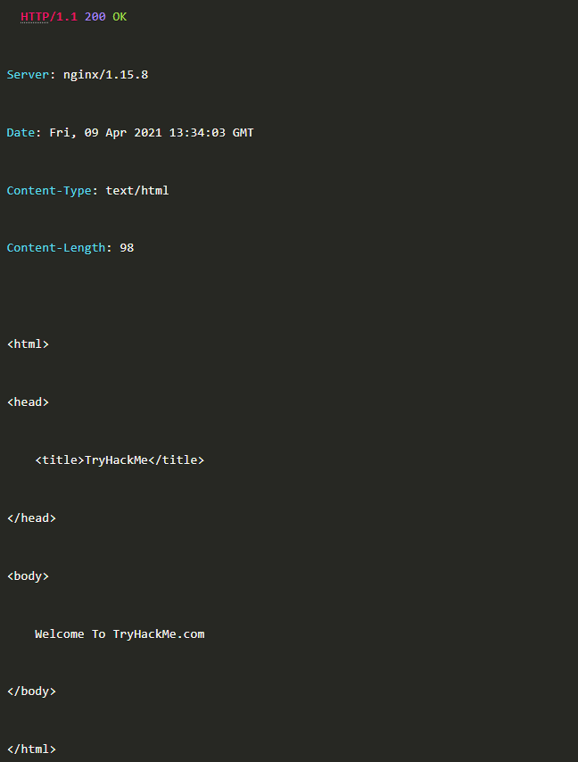

# What is HTTP? (HyperText Transfer Protocol)

Bir web sitesini görüntülemek istediğinizde o web sitesindeki html, resim ve video gibi çeşitli içeriklerin web clientına transferini sağlamakla görevli olan protokol HTTP protokolüdür.

## What is HTTPS? (HyperText Transfer Protocol Secure)

HTTPS, HTTP protokolünün güvenli olan versiyonudur. HTTPS, sadece web client ve web server arasındaki verileri şifrelemekle kalmaz bunun yanında o web serverını taklit eden bir şeyle konuşmadığınıza dair güvence de sağlar.,

# What is a URL? (Uniform Resource Locator)

URL tarayıcımıza, hedef serverda gidilmek istenilen kaynağın nerede bulunduğunu tarif eder. Aşağıdaki gösterimde URL'in tüm özelliklerini görebilirsiniz. (Her aramada URL'in tüm özelliklerini kullanmayız.)

## Scheme

Kaynağa erişmek için hangi protokolün kullanıldığını gösterir. (Örneğin HTTP, HTTPS, FTP olabilir.)

## User

Bazı servisler kimlik doğrulama gerektirir ve bu yüzden url'in bu kısmına kullanıcı adı ve parola girmeniz gerekir.

## Host

Erişmek istediğiniz web serverının domain name'i ya da IP adresidir

##  Port

Bağlanacağınız portu ifade eder. HTTP için -> 80 portu, HTTPS için -> 443 portu kullanılır ama bunun haricinde 1 - 65535 arasında herhangi portu içerebilir.

## Path

Erişmek istediğin kaynağın bulunduğu konumu daha doğrusu dosya yolunu ifade eder.

## Query String

Erişilmek istenilen yola ek olarak gönderilebilecek ekstra bitleri içerir. Bu ekstra bitler filtreleme, sıralama ve arama gibi çeşitli işlevlere yarayabilir. 

Örneğin, /blog? id=1 ifadesi blog path'ine "1" ID'sine sahip blog makalesini almayı söyler.

## Fragment

İstekte bulunan kaynağın içerisindeki sayfanın belirli bir parçasına erişmeye olanak tanır. Örneğin uzun bir sayfa olduğunu varsayarsak, o sayfanın sadece belirli bir kısmına erişmek isteyebiliriz.

# Making a Request

GET / HTTP/1.1 sadece bu ifadeyi yazarak bir web serverına istekte bulunabiliriz. Ama genelde bu çok yetersiz olacağından bir isteği ekstra bilgiler içeren "Header"ların içinde göndeririz. (Header konusuna sonra bakacağız.)

## BİR İSTEK ÖRNEĞİ OLARAK;

verebiliriz.

Şimdi bu isteği daha yakından inceleyelim.

## Line 1

Bu istek web serverından bilgi almak için "GET" methodunu kullanıyor, ana sayfayı "/" ile istiyor ve web serverına HTTP protokolünün 1.1 sürümünü kullandığımızı söylüyor.

## Line 2

Web sunucusuna tryhackme.com web sitesini istediğimizi belirtiyoruz.

## Line 3

Web serverına kullandığımız tarayıcının ismini ve versiyonunu söylüyoruz.

## Line 4

Web serverına bizi buraya yönlendiren web sayfasının ne olduğunu söylüyoruz.

## Line 5

HTTP istekleri, isteğin bittiğini web serverına bildirmek için her zaman boş bir satırla biter.

## CEVAP İSE ŞU ŞEKİLDE OLABİLİR;

## Line 1

HTTP 1.1 serverın kullandığı HTTP protokolünün sürümüdür, ardından gelen "200 OK" ifadesi HTTP durum kodudur ve isteğin başarıyla tamamlandığını belirtir.

## Line 2

Bu satır bize web serverında çalışan web server yazılımını ve onun sürümünü ifade eder.

## Line 3

Web serverının geçerli tarihi, saati ve saat dilimini söyler.

## Line 4

Content-Type header'ı, clienta HTML, resim, video, pdf veya XML gibi ne tür bilgilerin gönderileceğini söyler.

## Line 5

Content-Lenght header'ı, clienta yanıtın ne kadar uzun olduğunu söyler ve böylece hiçbir verinin eksik olmadığı doğrulanabilir.

## Line 6

Aynı istekte de olduğu gibi yanıtın sonunu doğrulamak için de boş bir satır kullanılır.

## Line 7-14

İstenilen bilgiyi içerir. Yukarıdaki örnekte istenilen bilgi ana sayfa olduğundan yanıtta da html kodlarıyla bu web sayfasını istemciye yollamış.

